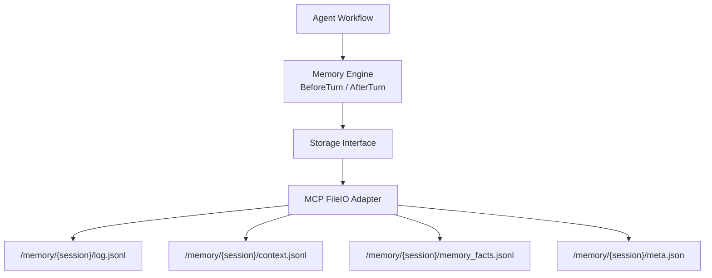

# Agents Storage & Memory SDK Manual

This manual explains how to use the SDKs implemented in:

- `agents/files`: standardized MCP FileIO storage SDK
- `agents/memory`: standardized agent memory SDK built on top of storage

The document is written for developers with no prior MCP or memory-system background.

## 1) Why This Exists

Chat agents usually lose context when a session grows large or restarts. This SDK pair solves that problem with a clean separation:

1. **Storage layer** (`agents/files`): a reusable abstraction and MCP FileIO adapter.
2. **Memory layer** (`agents/memory`): turn-based memory engine (`BeforeTurn` / `AfterTurn`) for history persistence, recall, and context compaction.

This follows clean architecture:

- Domain contracts are explicit (`Storage`, `Engine`, DTOs).
- Infrastructure details (MCP JSON-RPC, sessions, tool calling) are isolated in `agents/files`.
- Memory engine depends only on storage interfaces, not HTTP/MCP internals.

## 2) Architecture Overview



## 3) Data Layout

Each session stores memory under:

```text
/memory/{session_id}/
	├── log.jsonl
	├── context.jsonl
	├── memory_facts.jsonl
	└── meta.json
```

- `log.jsonl`: immutable source-of-truth event history.
- `context.jsonl`: active context mirror for model input.
- `memory_facts.jsonl`: structured long-term facts.
- `meta.json`: idempotency and session bookkeeping.

## 4) Install and Import

This project already contains the implementation. If you use it from another module:

```bash
go get github.com/Laisky/go-utils/v6
```

Import packages:

```go
import (
		"github.com/Laisky/go-utils/v6/agents/files"
		"github.com/Laisky/go-utils/v6/agents/memory"
)
```

## 5) MCP Storage SDK Quick Start

### 5.1 Create MCP client and storage adapter

```go
ctx := context.Background()

client, err := files.NewMCPClient(files.MCPClientConfig{
		Endpoint: "https://mcp.laisky.com",
		APIKey:   os.Getenv("MEMORY_MCP_API_KEY"),
})
if err != nil {
		panic(err)
}

storage, err := files.NewMCPStorage(files.MCPStorageConfig{
		Caller: client,
})
if err != nil {
		panic(err)
}

_ = storage
```

### 5.2 Storage interface methods

`files.Storage` provides:

1. `Read`
2. `Write`
3. `Stat`
4. `List`
5. `Search`
6. `Delete`

The adapter validates MCP constraints for `project` and `path`, and retries retryable errors (for example `RESOURCE_BUSY`) with backoff.

## 6) Memory SDK Quick Start

### 6.1 Create engine

```go
engine, err := memory.NewEngine(storage, memory.Config{
		RecentContextItems: 30,
		RecallFactsLimit:   20,
		SearchLimit:        5,
		CompactThreshold:   0.8,
})
if err != nil {
		panic(err)
}
```

### 6.2 Standard turn lifecycle

```go
prepared, err := engine.BeforeTurn(ctx, memory.BeforeTurnInput{
		Project:   "your-tenant",
		SessionID: "session-001",
		UserID:    "user-001",
		TurnID:    "turn-001",
		CurrentInput: []memory.ResponseItem{
				{
						Type: "message",
						Role: "user",
						Content: []memory.ResponseContentPart{
								{Type: "input_text", Text: "I prefer concise answers"},
						},
				},
		},
		MaxInputTok: 120000,
})
if err != nil {
		panic(err)
}

// Send prepared.InputItems to your model API.
modelOutput := []memory.ResponseItem{
		{
				Type: "message",
				Role: "assistant",
				Content: []memory.ResponseContentPart{
						{Type: "output_text", Text: "Understood."},
				},
		},
}

err = engine.AfterTurn(ctx, memory.AfterTurnInput{
		Project:     "your-tenant",
		SessionID:   "session-001",
		UserID:      "user-001",
		TurnID:      "turn-001",
		InputItems:  prepared.InputItems,
		OutputItems: modelOutput,
})
if err != nil {
		panic(err)
}
```

## 7) Runtime Behavior

### 7.1 `BeforeTurn`

1. Reads `context.jsonl` and `memory_facts.jsonl`.
2. Recalls related chunks using storage `Search`.
3. Builds memory block + recent context + current input.
4. Estimates token load and compacts context when threshold is reached.

### 7.2 `AfterTurn`

1. Loads `meta.json` and checks turn idempotency.
2. Appends input/output events into `log.jsonl` and `context.jsonl`.
3. Extracts simple facts and appends to `memory_facts.jsonl`.
4. Updates `meta.json` with latest turn watermark.

## 8) cURL Reference (MCP)

Use these calls if you need to debug MCP behavior directly.

### 8.1 Initialize MCP session

```bash
curl -i -sS "https://mcp.laisky.com" \
	-H 'Content-Type: application/json' \
	-H "Authorization: Bearer ${MCP_API_KEY}" \
	--data-raw '{
		"jsonrpc":"2.0",
		"id":1,
		"method":"initialize",
		"params":{
			"protocolVersion":"2025-06-18",
			"capabilities":{},
			"clientInfo":{"name":"manual","version":"1.0.0"}
		}
	}'
```

### 8.2 Write one file

```bash
curl -sS "https://mcp.laisky.com" \
	-H 'Content-Type: application/json' \
	-H "Authorization: Bearer ${MCP_API_KEY}" \
	-H "Mcp-Session-Id: ${MCP_SESSION_ID}" \
	--data-raw '{
		"jsonrpc":"2.0",
		"id":2,
		"method":"tools/call",
		"params":{
			"name":"file_write",
			"arguments":{
				"project":"your-tenant",
				"path":"/memory/demo/context.jsonl",
				"content":"{\"type\":\"message\"}\n",
				"mode":"APPEND"
			}
		}
	}'
```

### 8.3 Read one file

```bash
curl -sS "https://mcp.laisky.com" \
	-H 'Content-Type: application/json' \
	-H "Authorization: Bearer ${MCP_API_KEY}" \
	-H "Mcp-Session-Id: ${MCP_SESSION_ID}" \
	--data-raw '{
		"jsonrpc":"2.0",
		"id":3,
		"method":"tools/call",
		"params":{
			"name":"file_read",
			"arguments":{
				"project":"your-tenant",
				"path":"/memory/demo/context.jsonl",
				"offset":0,
				"length":-1
			}
		}
	}'
```

## 9) Testing and Quality

Implemented tests include:

- `agents/files/mcp_storage_test.go`
    - parameter mapping
    - retry on retryable MCP error
    - metadata mapping
    - input validation
- `agents/memory/engine_test.go`
    - idempotent `AfterTurn`
    - fact recall in `BeforeTurn`
    - compaction trigger behavior
- `agents/memory/behavior_test.go`
    - end-to-end lifecycle behavior

## 10) Operational Notes

1. Keep `project` as tenant boundary.
2. Use one writer per `session_id` to reduce conflicts.
3. Treat storage search as eventually consistent.
4. Keep API keys only in environment variables.

## 11) Troubleshooting

1. `INVALID_PATH`: verify absolute path format (`/memory/...`) and valid project name.
2. `RESOURCE_BUSY`: automatic retry exists; if frequent, reduce concurrent writers.
3. Empty recall: check whether `memory_facts.jsonl` has extracted facts and whether query text is meaningful.

## 12) Minimal Adoption Checklist

1. Create `files.MCPClient` + `files.MCPStorage`.
2. Create `memory.Engine` with that storage.
3. Insert `BeforeTurn` before model call.
4. Insert `AfterTurn` after model output.
5. Monitor `meta.json`, `context.jsonl`, and `memory_facts.jsonl` for expected behavior.
