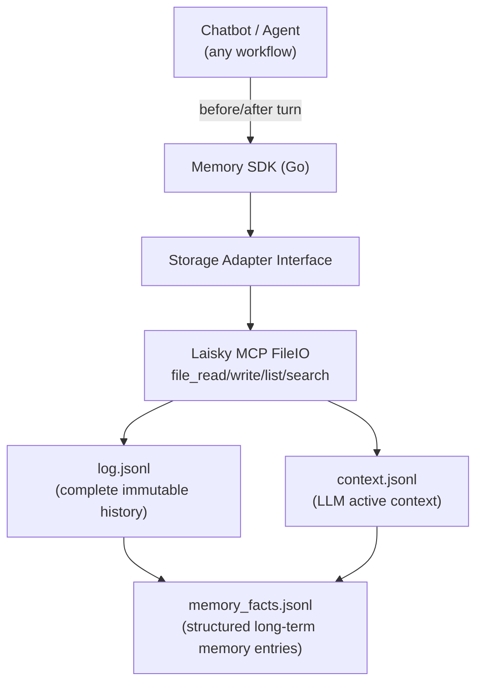

# General-purpose Golang Memory Library Technical Manual (OneAPI Responses API + Laisky MCP FileIO)

## 1. Document Purpose

This document defines a reusable Memory SDK solution to provide long-term memory capabilities for any chat-type chatbot/agent.
The goal is to enable an engineering team unfamiliar with the current state to complete design, development, testing, and integration by following this document.

This document is based on:

1. Golang
2. OneAPI Responses API (`https://oneapi.laisky.com/v1/responses`) as inference and summarization/extraction model interface
3. Laisky MCP FileIO (as remote persistent storage)

## 2. Background and Problems

Most chatbots only retain short conversation context, leading to typical issues:

1. User preferences are lost across sessions
2. Long task context cannot be stably continued after exceeding window size
3. Intermediate states of multi-tool execution cannot be reliably reused
4. History is not retrievable or retrieval quality is unstable

A memory layer independent of the business agent is needed, with:

1. Persistent session history (traceable)
2. Long-term memory extraction and recall (retrievable)
3. Automatic context compression (sustainable)
4. Unified interface for upper layers (embeddable in any chat workflow)

## 3. Goals and Non-goals

### 3.1 Goals

1. Provide a Go SDK decoupled from specific agents
2. Can connect to any LLM provider (OneAPI Responses API reference implementation provided)
3. Pluggable storage layer (default MCP FileIO Adapter)
4. Support idempotent writes under at-least-once invocation
5. Support multi-tenant isolation (project/session/user)

### 3.2 Non-goals

1. Not responsible for business tool execution (tools orchestration is done by the agent itself)
2. Not bound to any frontend protocol (WebSocket/SSE/Slack/IM)
3. Strongly consistent distributed transactions not solved in v1

## 4. Overall Architecture



## 5. Mapping to Laisky MCP FileIO

Refer to `docs/ref/fileio.md`, the SDK must comply with the following key constraints:

1. All paths must be absolute (non-root paths start with `/`)
2. Content encoding uses `utf-8`
3. Core tools:
    1. `file_write`: append/overwrite write
    2. `file_read`: partial read
    3. `file_stat`: path existence and metadata
    4. `file_list`: directory traversal
    5. `file_search`: retrieval/recall
    6. `file_delete`: delete
4. Error code-driven retry strategy (e.g., `RESOURCE_BUSY`, `NOT_FOUND`, `INVALID_PATH`)

### 5.1 MCP Client Requirements

The SDK requires an internal MCP JSON-RPC client, with minimum capabilities:

1. `initialize` session establishment, cache `Mcp-Session-Id`
2. `tools/call` generic invocation
3. Error unpacking into unified error structure `{code, message, retryable}`

## 6. Data Model and Directory Specification

### 6.1 Path Convention

Use `project=<tenant>` as the tenant isolation unit. Recommended single-session path:

```text
/memory/{session_id}/
	├── log.jsonl
	├── context.jsonl
	├── memory_facts.jsonl
	├── checkpoints/
	│   └── compact-<ts>.json
	└── meta.json
```

### 6.2 File Responsibilities

1. `log.jsonl`: Source of truth, records user/assistant/tool response items, not pruned
2. `context.jsonl`: Context mirror sent to LLM, may include compact events
3. `memory_facts.jsonl`: High-value long-term memory (preferences, identity, constraints, ongoing tasks)
4. `meta.json`: Session metadata (version, latest compact point, idempotency watermark)

### 6.3 JSONL Event Format (Recommended)

```json
{"id":"evt_001","ts":"2026-02-13T12:00:00Z","type":"user_message","turn_id":"t1","content":"I like concise answers"}
{"id":"evt_002","ts":"2026-02-13T12:00:02Z","type":"assistant_message","turn_id":"t1","content":"Noted"}
{"id":"evt_003","ts":"2026-02-13T12:00:03Z","type":"fact_upsert","fact_id":"f_pref_style","key":"reply_style","value":"concise","confidence":0.92}
{"id":"evt_004","ts":"2026-02-13T12:30:00Z","type":"compact","summary":"...","from_event_id":"evt_001","to_event_id":"evt_200"}
```

## 7. Go Interface Design (Core)

### 7.1 Storage Abstraction Interface

```go
package memory

import "context"

type WriteMode string

const (
	WriteModeAppend   WriteMode = "APPEND"
	WriteModeOverwrite WriteMode = "OVERWRITE"
	WriteModeTruncate WriteMode = "TRUNCATE"
)

type FileChunk struct {
	FilePath   string
	StartBytes int64
	EndBytes   int64
	Content    string
	Score      float64
}

type FileInfo struct {
	Path      string
	Exists    bool
	Type      string // FILE|DIRECTORY|UNKNOWN
	SizeBytes int64
	UpdatedAt string
}

type Storage interface {
	Read(ctx context.Context, project, path string, offset, length int64) (string, error)
	Write(ctx context.Context, project, path, content string, mode WriteMode, offset int64) error
	Stat(ctx context.Context, project, path string) (FileInfo, error)
	List(ctx context.Context, project, path string, depth, limit int) ([]FileInfo, bool, error)
	Search(ctx context.Context, project, query, pathPrefix string, limit int) ([]FileChunk, error)
	Delete(ctx context.Context, project, path string, recursive bool) error
}
```

### 7.2 Memory Engine Interface

```go
package memory

import "context"

type ResponseItem struct {
	Type     string // message | function_call_output
	Role     string // for type=message: developer | user | assistant
	Content  []ResponseContentPart
	CallID   string // for type=function_call_output
	Output   string // for type=function_call_output
	Metadata map[string]string
}

type ResponseContentPart struct {
	Type     string // input_text | input_image | input_file | output_text
	Text     string
	ImageURL string
	FileID   string
	Filename string
}

type BeforeTurnInput struct {
	Project          string
	SessionID        string
	UserID           string
	TurnID           string
	CurrentInput     []ResponseItem // current turn input items in Responses API style
	BaseInstructions string        // mapped to Responses API `instructions`
	MaxInputTok      int
}

type BeforeTurnOutput struct {
	InputItems        []ResponseItem // final input items to send to Responses API `input`
	RecallFactIDs     []string
	ContextTokenCount int
}

type AfterTurnInput struct {
	Project     string
	SessionID   string
	UserID      string
	TurnID      string
	InputItems  []ResponseItem // request input items sent in this turn
	OutputItems []ResponseItem // response output items returned by Responses API
}

type Engine interface {
	BeforeTurn(ctx context.Context, in BeforeTurnInput) (BeforeTurnOutput, error)
	AfterTurn(ctx context.Context, in AfterTurnInput) error
}
```

### 7.3 Design Principles

1. `BeforeTurn/AfterTurn` are symmetric, making it easy to integrate with any agent loop
2. Input/output uses Responses API-style items (`type`, `role`, `content[]`), avoiding Chat Completions-only structures
3. Separated from OneAPI/OpenAI-compatible adaptation layer to avoid core logic being locked to a provider

## 8. Key Process Implementation

### 8.1 BeforeTurn (Read Path)

Execution order:

1. Read `meta.json` and `context.jsonl`
2. Write the current user message to `log.jsonl` first (idempotent, deduplicated by `turn_id`)
3. Recall long-term memory:
    1. Prefer reading the latest high-confidence entries from `memory_facts.jsonl`
    2. Call `file_search` to retrieve relevant history under `/memory/{session_id}/`
4. Build context:
    1. `instructions` (optional, mapped from `BaseInstructions`)
    2. `memory block` as Responses API `message` item(s) (facts + retrieved fragments)
    3. Most recent N `context.jsonl` input items
    4. Current turn `CurrentInput` items
5. Estimate tokens, trigger compression if threshold exceeded

### 8.2 AfterTurn (Write Path)

Execution order:

1. Append current turn request `InputItems` and response `OutputItems` to `log.jsonl`
2. Append visible/rehydratable items to `context.jsonl`
3. Trigger fact extraction:
    1. Rule-based extraction (low cost)
    2. Optionally call OneAPI Responses API for structured extraction (high quality)
4. `fact_upsert` write to `memory_facts.jsonl`
5. Update `meta.json` (latest turn, compact info)

### 8.3 Compact (Context Compression)

Trigger conditions:

1. `context token >= max_input_tokens * 0.8`
2. Or LLM endpoint returns context overflow error

Algorithm suggestions:

1. Retain the most recent `K` raw response items (e.g., last 30)
2. Summarize earlier segments as a `compact` event written to `context.jsonl`
3. `log.jsonl` is not rewritten, ensuring complete traceable history
4. Record compact boundaries in `meta.json`

## 9. OneAPI Responses API Integration Specification

### 9.1 Adaptation Strategy

Memory SDK only outputs standard `[]ResponseItem`.
The business layer maps this to the Responses API request format and sends it to `https://oneapi.laisky.com/v1/responses`.

### 9.2 Minimal HTTP Client (Example)

```go
package oneapiadapter

import (
	"bytes"
	"context"
	"encoding/json"
	"fmt"
	"io"
	"net/http"
)

type InputItem struct {
	Type    string             `json:"type"`
	Role    string             `json:"role,omitempty"`
	Content []InputContentPart `json:"content,omitempty"`
	CallID  string             `json:"call_id,omitempty"`
	Output  string             `json:"output,omitempty"`
}

type InputContentPart struct {
	Type     string `json:"type"`
	Text     string `json:"text,omitempty"`
	ImageURL string `json:"image_url,omitempty"`
	FileID   string `json:"file_id,omitempty"`
	Filename string `json:"filename,omitempty"`
}

type ResponseReq struct {
	Model        string      `json:"model"`
	Instructions string      `json:"instructions,omitempty"`
	Input        []InputItem `json:"input"`
}

func CreateResponse(ctx context.Context, apiKey string, req ResponseReq) ([]byte, error) {
	b, err := json.Marshal(req)
	if err != nil {
		return nil, err
	}
	httpReq, err := http.NewRequestWithContext(ctx, http.MethodPost, "https://oneapi.laisky.com/v1/responses", bytes.NewReader(b))
	if err != nil {
		return nil, err
	}
	httpReq.Header.Set("Authorization", "Bearer "+apiKey)
	httpReq.Header.Set("Content-Type", "application/json")
	resp, err := http.DefaultClient.Do(httpReq)
	if err != nil {
		return nil, err
	}
	defer resp.Body.Close()
	body, err := io.ReadAll(resp.Body)
	if err != nil {
		return nil, err
	}
	if resp.StatusCode < 200 || resp.StatusCode >= 300 {
		return nil, fmt.Errorf("responses api status=%d body=%s", resp.StatusCode, string(body))
	}
	return body, nil
}
```

When implementing, please complete:

1. Timeout and retry
2. Response status code handling
3. Usage token statistics and logging

## 10. Installation and Project Skeleton

### 10.1 Initialization

```bash
mkdir go-memory-sdk && cd go-memory-sdk
go mod init your.org/memory
go get github.com/google/uuid
```

### 10.2 Recommended Directory

```text
/memory
  /cmd/example-agent/main.go
  /internal/mcp/client.go
  /internal/storage/fileio_adapter.go
  /internal/recall/search.go
  /internal/compact/compact.go
  /pkg/memory/engine.go
  /pkg/memory/types.go
  /pkg/memory/config.go
```

### 10.3 Environment Variables

```bash
export ONEAPI_API_KEY="<key>"
export ONEAPI_BASE_URL="https://oneapi.laisky.com"
export MEMORY_MCP_ENDPOINT="https://mcp.laisky.com"
export MEMORY_MCP_API_KEY="<key>"
export MEMORY_PROJECT="your-tenant"
```

## 11. Usage (Integrating with Any Chat Agent)

### 11.1 Standard Integration Point

```go
prepared, err := mem.BeforeTurn(ctx, memory.BeforeTurnInput{
	Project:   project,
	SessionID: sessionID,
	UserID:    userID,
	TurnID:    turnID,
	CurrentInput: []memory.ResponseItem{
		{
			Type: "message",
			Role: "user",
			Content: []memory.ResponseContentPart{
				{Type: "input_text", Text: userText},
			},
		},
	},
	BaseInstructions: systemPrompt,
	MaxInputTok:     120000,
})
if err != nil { /* handle */ }

// 业务层将 prepared.InputItems 直接作为 Responses API 的 input 发送到 oneapi.laisky.com
outputItems, err := runModel(prepared.InputItems)
if err != nil { /* handle */ }

err = mem.AfterTurn(ctx, memory.AfterTurnInput{
	Project:     project,
	SessionID:   sessionID,
	UserID:      userID,
	TurnID:      turnID,
	InputItems:  prepared.InputItems,
	OutputItems: outputItems,
})
if err != nil { /* handle */ }
```

### 11.2 Minimal Refactoring for Existing Workflows

1. Insert `BeforeTurn` before model invocation
2. Insert `AfterTurn` after model response
3. Change the original "only send recent chat messages" logic to "send the SDK-constructed response items"

## 12. Error Handling and Retry Strategy

### 12.1 MCP FileIO Error Levels

1. Retryable:
    1. `RESOURCE_BUSY`
    2. Network timeout
    3. 5xx
2. Non-retryable:
    1. `INVALID_PATH`
    2. `PERMISSION_DENIED`
    3. `NOT_FOUND` (can be downgraded as per business logic)

### 12.2 Recommended Strategy

1. Exponential backoff: `200ms -> 500ms -> 1s -> 2s`, up to 4 times
2. Turn-level idempotency key: `(session_id, turn_id)`
3. Downgrade path:
    1. If retrieval fails, continue conversation with only recent context
    2. If fact extraction fails, do not block main response

## 13. Concurrency and Consistency

It is recommended to use a single-writer-per-session model (Session Actor):

1. Write operations for the same `session_id` enter the same queue
2. Execute `BeforeTurn/AfterTurn` serially
3. Read operations can be parallel, but when building context, read the committed point of the write sequence

If multi-writer concurrency is required:

1. Use the version number in `meta.json` for optimistic concurrency control
2. After conflict, re-read and replay uncommitted events
3. Ensure `log.jsonl` is only appended, not modified in place

## 14. Security and Compliance

1. Sensitive information should be desensitized before writing to `memory_facts.jsonl`
2. `project` is the tenant boundary; cross-tenant path concatenation is prohibited
3. OneAPI and MCP keys are injected only via environment variables
4. Do not print full keys or raw private text in logs
5. Support fact deletion (Right to be forgotten): append `fact_delete` event and filter during recall

## 15. Testing Strategy

### 15.1 Unit Testing

1. Event serialization/deserialization
2. Deduplication logic (turn_id idempotency)
3. Compact boundary calculation
4. Error code retry branches

### 15.2 Integration Testing

1. Use test `project` for real MCP calls
2. Cover the full process of writing, reading, retrieval, and compression
3. Simulate Responses API context overflow and verify automatic compact

### 15.3 Regression Testing

1. Long session (1k+ turns) performance
2. Retrieval hit rate baseline
3. Consistency sampling evaluation before and after compact

## 16. Milestone Plan (Recommended)

1. M1 (1 week): MCP client + fileio adapter + log/context persistence
2. M2 (1 week): BeforeTurn/AfterTurn + basic recall
3. M3 (1 week): compact + fact extraction + error recovery
4. M4 (1 week): stress testing, observability, documentation, example agent

## 17. Acceptance Criteria

The SDK can be considered ready for production if and only if it meets:

1. Can be integrated with at least 2 types of chat agents (HTTP API bot + workflow agent)
2. No history loss in 1000-turn long sessions
3. Can automatically compact and continue conversation when context overflows
4. No duplicate write pollution under retry and idempotency mechanisms
5. Memory recall significantly outperforms the "recent messages only" baseline on evaluation set

## 18. Appendix: Minimal Implementation Checklist

1. `Storage` interface and `FileIOAdapter`
2. `Engine.BeforeTurn/AfterTurn`
3. `jsonl` event encoding/decoding
4. `CompactService`
5. `RecallService` (`memory_facts + file_search`)
6. OneAPI Responses request adapter
7. Runnable example (`cmd/example-agent`)
8. Unit + integration tests

Completing the above forms a reusable, pluggable, and production-evolvable general-purpose Golang memory library.
